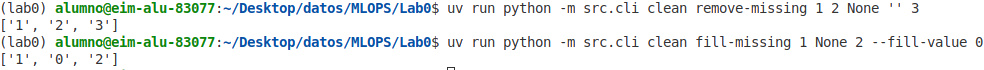
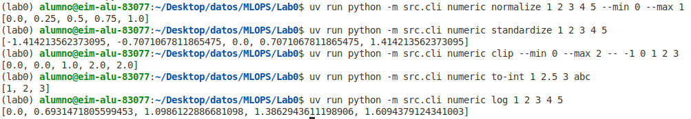
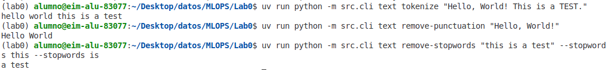
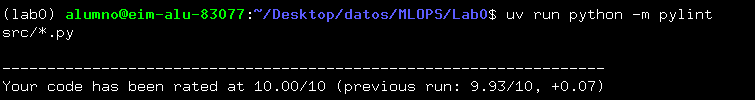
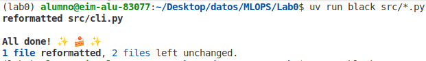
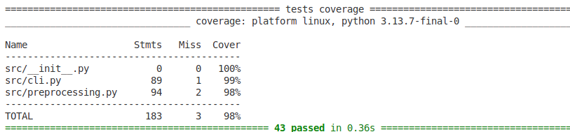

# Lab0: Fundamentals of Continuous Integration

This project implements various data preprocessing techniques with a command-line interface (CLI), demonstrating CI/CD best practices including linting, formatting, and comprehensive testing.

## Project Structure

```
Lab0/
├── src/
│   ├── __init__.py
│   ├── preprocessing.py    # Core preprocessing logic
│   └── cli.py             # Command-line interface
├── tests/
│   ├── __init__.py
│   ├── test_preprocessing.py  # Unit tests
│   └── test_cli.py           # Integration tests
├── assets/                # Screenshots for documentation
├── pyproject.toml
└── README.md
```

## Setup

1. Initialize the project environment:
```bash
uv init
uv sync
```

2. Install dependencies:
```bash
uv add click black pylint pytest pytest-cov
```
3. Activate the virtual environment
```bash
 source .venv/bin/activate
 ```

## Features

### Data Cleaning
- Remove missing values (None, '', nan)
- Fill missing values with a specified value
- Remove duplicate values

### Numerical Operations
- Min-max normalization
- Z-score standardization
- Value clipping
- Type conversion to integers
- Logarithmic transformation

### Text Processing
- Tokenization
- Punctuation removal
- Stop words removal

### Data Structure Operations
- List flattening
- Random shuffling with seed support
- Extract unique values

## Usage

### Command Line Interface

The CLI is organized into four main groups:

#### Clean Group
Remove or fill missing values from your data:

```bash
# Remove missing values
uv run python -m src.cli clean remove-missing 1 2 None '' 3

# Fill missing values
uv run python -m src.cli clean fill-missing 1 None 2 --fill-value 0
```
- Result:



#### Numeric Group
Perform mathematical transformations on numerical data:

```bash
# Normalize values
uv run python -m src.cli numeric normalize 1 2 3 4 5 --min 0 --max 1

# Standardize values
uv run python -m src.cli numeric standardize 1 2 3 4 5

# Clip values
uv run python -m src.cli numeric clip --min 0 --max 2 -- -1 0 1 2 3

# Convert to integers
uv run python -m src.cli numeric to-int 1 2.5 3 abc

# Log transform
uv run python -m src.cli numeric log 1 2 3 4 5
```
- Result:



#### Text Group
Process and clean textual data:

```bash
# Tokenize text
uv run python -m src.cli text tokenize "Hello, World! This is a TEST."

# Remove punctuation
uv run python -m src.cli text remove-punctuation "Hello, World!"

# Remove stop words
uv run python -m src.cli text remove-stopwords "this is a test" --stopwords this --stopwords is
```
- Result:



#### Struct Group
Manipulate data structures:

```bash
# Shuffle list
uv run python -m src.cli struct shuffle 1 2 3 4 5 --seed 42

# Flatten list
uv run python -m src.cli struct flatten 1,2,3 4,5,6

# Get unique values
uv run python -m src.cli struct unique 1 2 2 3 3 3
```
- Result:


## Code Quality
### Linting
Analyze code quality and enforce coding standards:
```bash
uv run python -m pylint src/*.py
```
- Result :



What Pylint checks:

 1- Code errors and bugs
 2- Code style (PEP 8)
 3- Code complexity
 4- Duplicate code
 5- Documentation quality

# Formatting with Black
Automatically format code to maintain consistency:

```bash
uv run black src/*.py
```
- Result :



Black ensures:

Consistent line length (≤100 characters)
 1- Uniform indentation
 2- Standard quote usage
 3- Proper spacing around operators

# Testing
### Run All Tests
```bash
uv run python -m pytest -v
```
### Run Tests with Coverage Report

```bash
uv run python -m pytest -v --cov=src
```
- Result :



### Test Structure

- **Unit Tests** (`test_preprocessing.py`): Test individual functions in the preprocessing module
  - Uses fixtures for reusable test data
  - Uses parametrize decorator for testing multiple scenarios
  
- **Integration Tests** (`test_cli.py`): Test the CLI commands end-to-end
  - Uses CliRunner fixture for invoking CLI commands
  - Tests command groups and their interactions

## Dependencies

- **click**: CLI framework
- **black**: Code formatter
- **pylint**: Code linter
- **pytest**: Testing framework
- **pytest-cov**: Coverage plugin

## License

This project is for educational purposes as part of a Continuous Integration fundamentals course.

## Author
- Student Name: Maria Ines Haddad
- Course: MLOps - Fundamentals of Continuous Integration
- Institution: Public University of Navrra
- Date: 12/11/2025